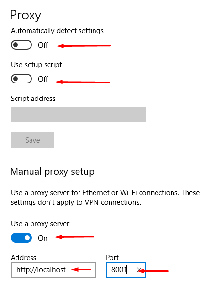

## Kiểm thử Gatlink

### 1. Chuẩn bị

#### 1.1. Cài đặt OS sử dụng Win10
#### 1.2. Cài đặt Java jre-8

- Tiến hành download file cài đặt java <a href="https://www.oracle.com/java/technologies/javase-jdk8-downloads.html" target="_blank">tại đây</a>
- Sau khi download xong ta tiền hành cài đặt như thông thường

#### 1.3. Download source Gatlink

- Tiến hành download source Gatlink <a href="https://repo1.maven.org/maven2/io/gatling/highcharts/gatling-charts-highcharts-bundle/3.2.0/gatling-charts-highcharts-bundle-3.2.0-bundle.zip
" target="_blank">tại đây</a>
- Sau khi download được source chúng ta tiến hành giải nén
- Trong folder gatlink nhận được sau khi giản nén sẽ có cấu trúc như sau

+ Bin: Chứa các script thực hiện Gatling và Recorder
+ Conf: Chứa cấu hình cho Gatling như Log, Report, ..
+ lib: Chứa thư viên sử dụng bởi Gatling
+ results: Chứa kết quả sau những lần thực hiện test
+ user-files: Chứa dữ liệu người dùng
+ simulations: Chứa các kịch bản test (Scale file).

### 2 Thiết lập proxy trên trình duyệt 

- Trên trình duyệt chrome chúng ta sẽ thiết lập như các hình ảnh bên dưới để mọi request từ chrome sẽ đi qua proxy gatlink

+ Trong ảnh trên nếu website sử dụng giao thức https thì chúng ta phải nhập lại là https://localhost  , Ngoài ra port có thể thay đổi tùy theo nhu cầu miễn là port đó chưa sử dụng trên máy tính, ở ví dụ này chúng ta dùng port 8001

