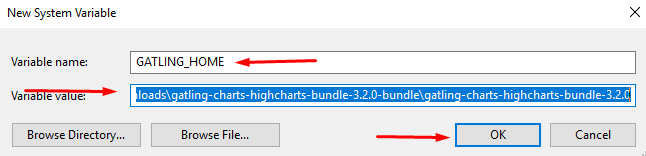

## Kiểm thử Gatlink

### 1. Chuẩn bị

#### 1.1. Cài đặt OS sử dụng Win10
#### 1.2. Cài đặt Java jre-8

- Tiến hành download file cài đặt java <a href="https://www.oracle.com/java/technologies/javase-jdk8-downloads.html" target="_blank">tại đây</a>
- Sau khi download xong ta tiền hành cài đặt như thông thường

#### 1.3. Download source Gatlink

- Tiến hành download source Gatlink <a href="https://repo1.maven.org/maven2/io/gatling/highcharts/gatling-charts-highcharts-bundle/3.2.0/gatling-charts-highcharts-bundle-3.2.0-bundle.zip
" target="_blank">tại đây</a>
- Sau khi download được source chúng ta tiến hành giải nén
- Trong folder gatlink nhận được sau khi giản nén sẽ có cấu trúc như sau

+ Bin: Chứa các script thực hiện Gatling và Recorder
+ Conf: Chứa cấu hình cho Gatling như Log, Report, ..
+ lib: Chứa thư viên sử dụng bởi Gatling
+ results: Chứa kết quả sau những lần thực hiện test
+ user-files: Chứa dữ liệu người dùng
+ simulations: Chứa các kịch bản test (Scale file).

### 2 Thiết lập proxy trên trình duyệt 

- Trên trình duyệt chrome chúng ta sẽ thiết lập như các hình ảnh bên dưới để mọi request từ chrome sẽ đi qua proxy gatlink

+ Trong ảnh trên nếu website sử dụng giao thức https thì chúng ta phải nhập lại là https://localhost  , Ngoài ra port có thể thay đổi tùy theo nhu cầu miễn là port đó chưa sử dụng trên máy tính, ở ví dụ này chúng ta dùng port 8001

### Sử dụng Gatlink

#### 2.1 Sử dụng Gatling Recorder để quay lại kịch bản mô phỏng thao tác 1 người dùng bình thường

- Chúng ta mở Source của gatlink đã download từ trước đó lên như hình ảnh bên dưới

- Tiếp theo chúng ta truy cập vào thư mục bin và click chuột phải vào file recorder và chọn Run as administrator

- Sau thao tác trên có cửa sổ cmd hiện ra thông báo như hình ảnh bên dưới có nghĩa là chúng ta đang gặp lỗi chưa khai báo biến môi trường cho chương trình thực thi

- Với lỗi này chúng ta xử lý như sau

- Khai báo biến mới với Name là JAVA_HOME và giá trị trỏ tới đường dẫn thư mục cài đặt Java

- Khai báo biến mới với Name là GATLING_HOME và giá trị trỏ tới đường dẫn source gatling download về trước đó

- Tiếp theo chúng ta chỉnh lại patch trong system variables 

- Tạo 2 giá trị mới với tên %JAVA_HOME%\bin và %GATLING_HOME%\bin chúng ta sẽ được kết quả như bên dưới

- Tiếp theo chúng ta chạy lại file recorder như bước trên, sau khi chạy file recorder thành công sẽ hiển thị 1 cửa sổ như hình ảnh bên dưới

- Tiếp đến chúng ta chỉnh sửa cấu hình để sử dụng, thay port từ 8000 thành 8001 như ở bước thiết lập proxy trên chrome , đặt tên cho kịch bản

- Tiếp theo chúng ra click vào nút start ở bên dưới để recorder bắt đầu ghi

- Sau khi start chương trình chúng ta sẽ thao tác truy cập vào website như 1 người dùng bình thường thực hiện một số thao tác cơ bản nhu vào trang chủ, đọc bài viết, truy cập admin . Khi thao tác xong chúng ta stop chương trình như hình ảnh bên dưới

- Khi đó chúng ta sẽ thu được 1 file mô phỏng các thao tác của người dùng như hình ảnh bên dưới

#### 2.2 Sử dụng gatling test 

- Chúng ta sẽ chạy kịch bản vừa quay được với Gatling test như sau

- Sau đó chờ một chút sẽ xuất hiện cửa sổ CMD, tiếp đó chúng ta chọn đúng kịch bản vừa quay như ảnh bên dưới

- Sau khi nhập id và bấm enter thì tiếp tục enter một lần nữa sau đó chờ màn hình chạy trong và trả về kết quả như ảnh bên dưới

- Copy đường dẫn và truy cập đường dẫn bằng chrome như link ảnh bên dưới

